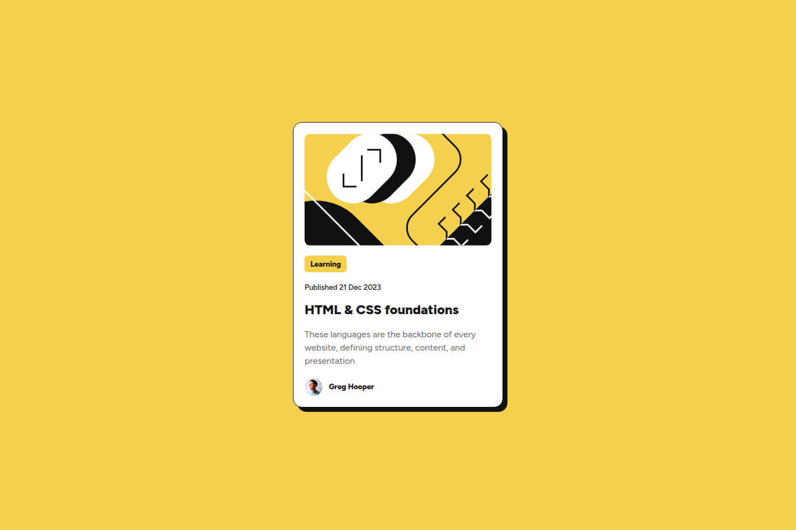

# Frontend Mentor - Blog preview card solution

This is a solution to the [Blog preview card challenge on Frontend Mentor](https://www.frontendmentor.io/challenges/blog-preview-card-ckPaj01IcS). Frontend Mentor challenges help you improve your coding skills by building realistic projects.

## Table of contents

- [Overview](#overview)
  - [Screenshot](#screenshot)
  - [Links](#links)
- [My process](#my-process)
  - [Built with](#built-with)
  - [Continued development](#continued-development)
  - [Useful resources](#useful-resources)
- [Author](#author)

## Overview

### The challenge

Users should be able to:

- See hover and focus states for all interactive elements on the page

### Screenshot

### Links

- Solution URL: [Repository](https://github.com/amShuri/blog-preview-card)
- Live Site URL: [Live](https://amshuri.github.io/blog-preview-card/)

## My process

### Built with

- Semantic HTML5 markup
- CSS
- Flexbox

### Useful resources

- [CSS box-shadow](https://www.w3schools.com/cssref/css3_pr_box-shadow.php) - Quick refresher on syntax for adding shadows.
- [HTML `<time>` element](https://developer.mozilla.org/en-US/docs/Web/HTML/Reference/Elements/time) - Used for the Published Date for better semantic meaning.

## Author

- GitHub - [amShuri](https://github.com/amShuri/)
- Frontend Mentor - [@amShuri](https://www.frontendmentor.io/profile/amShuri)
- Twitter - [@amShuri7](https://www.twitter.com/amshuri7)
